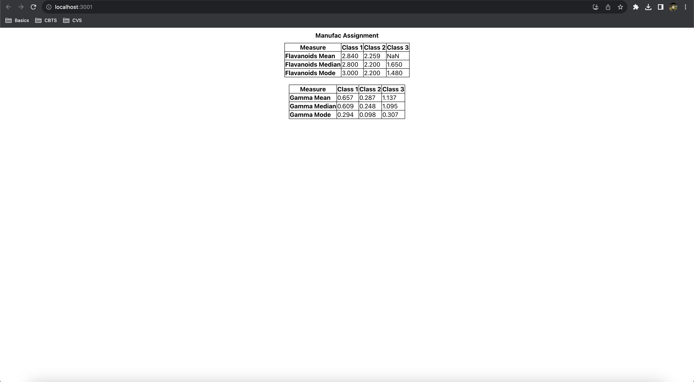

Steps to start the project

1. Open the terminal and use git clone https://github.com/tandonanirudh1506/manufac-assignment.git

2. After cloning the repo, run command yarn install to install the node_modules.

3. To build the project, run command yarn build.

4. To run the project, run command yarn start.

